# Blender Arayüz 
### Giriş
 Blender özgür,açık kaynak kodlu 3D modelleme aracıdır. 

 Neler yapılabilir:

1. 3D modelleme
2. animasyon, 
3. görsel efektler (VFX), 
4. Simülasyonlar,
5. Oyun geliştirme ve render işlemleri 

Kurulum

https://www.blender.org  websitesinden güncel kurulumları yapabilirsiniz.

Windows için sistem gereksinimleri:

Linux

----
Kurulum işlemi tamamlandıktan sonra ortalama şöyle bi ekranla karşılacaksınız.

1. dil ayarı 
2. Kısayol ayarları
3. Mouse hangi tuşuyla
4. Boşluk tuşuna basınca ne yapılmalı burda play animasyonu oynatın demek.
5. Tema seçimi.

EditBlender/ Preferences Preferences.PNG

1. Arayüzü değiştirebildiğimiz kısım
2. Temayı (dark mode ,yazı stilleri vs) ayarlandığı kısım
3. Add-ons blenderda birçok eklenti vardır bu kısımdan eklenti ekleyip çıkarabiliriz.
4. Save load kısmından kaç dakikada bir save alınacağı ayarlanabilir.

Kısayollar:

Görünüm ve Kamera:

1. Numpad 1: Ön görünüm

2. Numpad 3: Sağ görünüm

3. Numpad 7: Üst görünüm

4. Numpad 5: Perspektif/görünüm modu değiştir

5. Numpad 0: Kameradan görünümü aktif et

6. shift+mouse :tekerliğine basarsanız  sahnede istediğiniz yere doğru hareket edebilrisiniz

7. Mouse tekerleği: ile sahne etrafında dönebilirsiniz.

Nesne taşıma:

1. G: Nesneyi taşı (Grab)

2. G+Y : Y ekseninde nesneyi taşı.

3. G+X : X ekseninde nesneyi taşı.

4. G+Z : Z ekseninde nesneyi taşı.

5. G+CTRL: Birim birim taşı.

Nesne  döndürme:

1. R: Döndürme (Rotate).

2. R+Y : Y ekseninde nesneyi döndür.

3. R+Z : Z ekseninde nesneyi döndür.

4. R+X : X ekseninde nesneyi döndür.

Nesne  Boyutlandırma:

1. S: Nesneyi boyutlandır (Scale)

2. S+Y : Y ekseninde nesneyi boyutlandır.

3. S+X : X ekseninde nesneyi boyutlandır.

4. S+Z : Z ekseninde nesneyi boyutlandır.

Tüm bunları  N ile panelini açıp yapabilirsiniz.

Nesne  isimlendirme:

f2 tuşuna basıp kısaca isimlendirme yapılabili.

Nesne Ekleme ekranı 

Yukardan  add kısmından yada shift+a kombinasyonuna basarsanız nesne ekleme menüsü açılır.

### 3D CURSOR

Blender ekranında bu şekilde gözüken yapıya 3D cursor denir.

* Blender’da sahneye bir nesne eklediğinde, bu nesne varsayılan olarak 3D Cursor’un bulunduğu konumda oluşturulur.

* 3D Cursor, aynı zamanda döndürme, ölçekleme ve hizalama işlemlerinde pivot (merkez) noktası olarak da kullanılabilir

Shift+s tuşuna basarsanız cursorın menüsü ekrana gelir bu ekrandan cursor ile alakalı işlemleri kısayollardan halledebilirsiniz.

1.  Numara Cursoru sahnenin orjinine getirir.
2.  Seçilen nesnenin merkezine getirir.
3. Bir veya daha fazla nesne (veya vertex, edge, face) seçtiğinde, "aktif olan", yani en son seçtiğin öğe olur.
"Cursor to Active", işte bu aktif öğenin merkezine 3D Cursor'u taşır.
5. Diyelim ki cursor bir vertex'e veya nesneye göre ayarlandı ama küsüratlı koordinatlarda duruyor,Eğer 3D Cursor'u en yakın grid noktasına (tam sayı gibi) hizalamak istersen kullanırsın.
5.
6. Seçilen nesneleri grid'e hizalar. Alttaki ızgaralara denk gelecek şekilde ayarlar
7. Cursor’a taşır ama  mesafeyi korur. Birden fazla nesneyi taşırken şeklin bozulmasını engeller.
8. Seçilen nesneyi cursorün bulunduğu yere getir.

## Gizmo ve Overlays
**Overlay**

 Overlay Nedir?
Overlay terimi, Blender’da sahnede görünen bazı görsel yardımcı araçları ifade eder. Bu araçlar, sahnede çalışma yaparken yardımcı olur ve daha fazla kontrol sağlar. Overlay'ler, ekstra bilgilere ve görsel rehberlere ulaşmanı sağlar.

Overlay’in Kapsadığı Öğeler:

-  Mesh Görünümü (Wireframe/Surface): Modelin üzerindeki poligonları, kenarları ya da yüzeyleri gösterebilir.

- Grid/Izgara: Sahnede yer alan grid ve ızgara çizgilerinin görünürlüğünü kontrol eder.

- Object Origins: Nesnelerin başlangıç noktalarının (origin) görünürlük ayarlarını kontrol eder.

- Normals: Nesnelerin yüzey normal çizgilerini (yüzey yönünü gösterir) görmek için kullanılır.

- Edge Lengths: Kenar uzunluklarını gösterir.

- Annotations: Çizimler, notlar ekleyebilirsin.

**Gizmo**

Gizmo, Blender’da nesneleri etkileşimli olarak taşımanızı, döndürmenizi ve ölçeklendirmenizi sağlayan görsel araç kümesidir. Gizmo’lar, manipülasyon işlemlerini kolaylaştırır.

Nesnenin, objenin veya seçim kutusunun etrafındaki görsel kılavuzlar (oklar ve çubuklar) etkileşime girerek nesneleri hareket ettirmeni sağlar.

Gizmo’a Ait Temel Araçlar:

* Move Gizmo (Taşıma): Yön oklarıyla nesneyi X, Y ve Z eksenlerinde hareket ettirmeni sağlar.

* Rotate Gizmo (Dönme): Nesneyi X, Y ve Z eksenlerinde döndürmek için dairesel oklar kullanır.

* Scale Gizmo (Ölçek): Nesnenin boyutlarını X, Y ve Z eksenlerinde değiştirmek için kullanılabilir.

**Shading**

Shading, Blender gibi 3D yazılımlarında bir modelin yüzeyine nasıl ışık düşeceğini ve nasıl görüneceğini belirleyen bir tekniktir. Yani, shading bir nesnenin ışık ve gölge oyunlarıyla nasıl görüneceğini ayarlamaya yarar.

Blender'da shading ile ilgili genelde iki ana şey konuşulur:

Nesnelerin ışıkla nasıl etkileşime gireceği (Yüzey gölgeleme).

Şekillerin ve materyallerin görünümünü ayarlama.

Sahne nesnelerinden sahne üzerinde istediğiniz türden öğelerin görünümünü kapatabilirsiniz.

* Gizmo Öğelerinden gizmoyla alakalı yerleri kapatabilirsiniz.

* Overlay Öğeerinden overlay ile alakalı yerleri kapatabilirsiniz.

* X-ray açarak nesnelerin arka tarafının görünmesini sağlayabilirsiniz.

* Shading Ayarları

   1. Nesnelerin bağlantı noktalarını gösteren kısmı açar. Bu ayarda nesne bağlantılarında problem olup olmadığını algılanır.
   2.  Mataryalsiz ham halinin gözükmesini seçer.
   3. Mataryal ile birlikte görünmesini gösterir.
   4. Işığa nesnenin nasıl tepki verdiğini gösterir.

---

Burası hiyerarşi kısmı buradan sahneye eklenen nesneleri görebilirsiniz.

 
 Hemen altındaki bu kısım nesnelerin özelliklerini gösteren kısımdır.

 Blenderda birden fazla mod bulunmaktadır.

 ## BLENDER MODLARI

 

***Mavi ile işaretlenmiş yerden modları değiştirebiliyoruz.***

### Modlar:

| **Mod Adı**              | **Ne Yapar?**                                                                                                                                         | **Ne Zaman Kullanılır?**                                                            |
|--------------------------|------------------------------------------------------------------------------------------------------------------------------------------------------|--------------------------------------------------------------------------------------|
| **Object Mode**  | Nesneleri taşır, döndürür, ölçeklendirir.| Nesnelerle temel işlem yapmak için.                                                 |
| **Edit Mode**             | Nesnenin vertex, kenar ve yüzeylerini düzenler.| Modelleme , detaylı düzenlemeler ve şekil vermek için.                                             |
| **Sculpt Mode**           | Modeli heykel gibi |  Organik şekiller, karakterler veya karmaşık yüzeyler oluştururken kullanılır.                                     |
| **Vertex Paint Mode**     | Nesnenin vertex'lerine renk ekler.| Nesnenin renk detaylarını düzenlerken ve dokusunu oluştururken kullanılır.                                             |
| **Weight Paint Mode**  | Rigging (kemik sistemi) sırasında kemiklerin ağırlıklarını düzenler.   | Karakter rigging ve animasyonlarında.                                               |
| **Texture Paint Mode**    | Modelin yüzeyine doku ekler ve bu dokuları fırça ile boyar.                                                                                          | Modelin üzerine renk ve desen eklemek için kullanılır.                             |
|

### EDİT MODE

| **Kısayol**        | **İşlevi**                                |
|--------------------|-------------------------------------------|
| `Tab`              | Object ↔ Edit Mode geçişi                 |
| `1` / `2` / `3`    | Vertex / Edge / Face seçim modları       |
| `A`                | Hepsini seç veya seçimi kaldır            |
| `B`                | Box Select (dikdörtgen seçim)             |
| `C`                | Circle Select (daire seçim)               |
| `L`                | Hoverlanan parçayı seç                    |
| `Ctrl + L`         | Seçili vertex'e bağlı tüm parçaları seç   |
| `X` / `Delete`     | Silme seçenekleri                         |
| `E`                | Extrude (çıkıntı oluştur)                 |
| `I`                | Inset (içe yüzey)                         |
| `F`                | Yüzey oluştur                             |
| `M` / `Alt + M`    | Merge (birleştir)                         |
| `G`                | Taşı (Grab)                               |
| `R`                | Döndür (Rotate)                           |
| `S`                | Ölçekle (Scale)                           |
| `Ctrl + R`         | Loop Cut (kenar boyunca kesme)(S+Z ile araları genişletebilirsin.)           |
| `Shift+z+0`| Loop Cutı düzleme|
| `Ctrl + B`         | Bevel (kenar yumuşatma)                  |
| `K`                | Knife Tool (kesme aracı)                 |
| `Alt + S`          | Normale göre ölçekle                     |
| `Shift + D`        | Kopyala (Duplicate)                      |
| `Alt + D`          | Bağlı kopya (Linked Duplicate)           |
| `P`                | Seçimi ayrı nesne yap (Separate)         |
| `Shift + S`        | Snap menüsü                              |
| `.` (nokta)        | Pivot Point ayarı                        |
| `O`                | Proportional Editing aç/kapat            |
| `H` / `Alt + H`    | Gizle / Göster                           |
| `Ctrl + F`         | Yüzey menüsü                             |
| `U`                | UV Mapping menüsü                        |

### Transform Orientations

Transform Orientation (Dönüştürme Yönelimi), nesneleri veya vertex/edge/face’leri taşırken (G), döndürürken (R) ya da ölçeklerken (S) hangi yönü referans alacağını belirler.

 

| **Orientation** | **Açıklama**                                                                 |
|------------------|------------------------------------------------------------------------------|
| **Global**       | Dünya eksenlerine göre (X, Y, Z)                                             |
| **Local**        | Nesnenin kendi yönelimine göre (nesne döndürülmüşse eksen de döner)         |
| **Normal**       | Seçili yüzeyin veya vertex'in yüzey normallerine göre yönlenir              |
| **Gimbal**       | Rotasyon açılarının (Euler) matematiksel görünümünü verir (animasyon için)  |
| **View**         | Kameranın (bakış açısının) yönüne göre                                      |
| **Cursor**       | 3D Cursor yönelimi baz alınır                          |
| **Custom**       | Kendi özel yönelimini tanımlayarak kullanabilirsin                          |

### Pivot Point

Blender'da Pivot Point, bir nesneyi döndürürken (R), ölçeklerken (S) veya başka bir dönüşüm yaparken referans alınacak merkezi belirler.

 

| **Pivot Türü**          | **Açıklama**                                                                 |
|--------------------------|------------------------------------------------------------------------------|
| **Bounding Box Center**  | Seçilen nesne veya elemanların kutu gibi çevresini sarar, ortasını referans alır |
| **Median Point**         | Seçimin ağırlıklı (ortalama) merkezini referans alır(sağ ve solda nesneler var dersek en çok nesnenin olduğu tarafı referans alır.)                          |
| **Individual Origins**   | Her nesne veya parçanın kendi merkezine göre işlem yapılır                    |
| **3D Cursor**            | Dönüşüm 3D Cursor noktasına göre yapılır                                     |
| **Active Element**       | Seçimdeki aktif (en son seçilen) elemana göre dönüşüm yapılır.(Genellikle rengi farklıdır.)               |

***NOT:NUMPAD ALTINDAKİ VİRGÜL NESNEYE YAKINLAŞMAYI SAĞLAR.**

### Snapping 
Objeleri birbirine tutturmayı sağlar.

 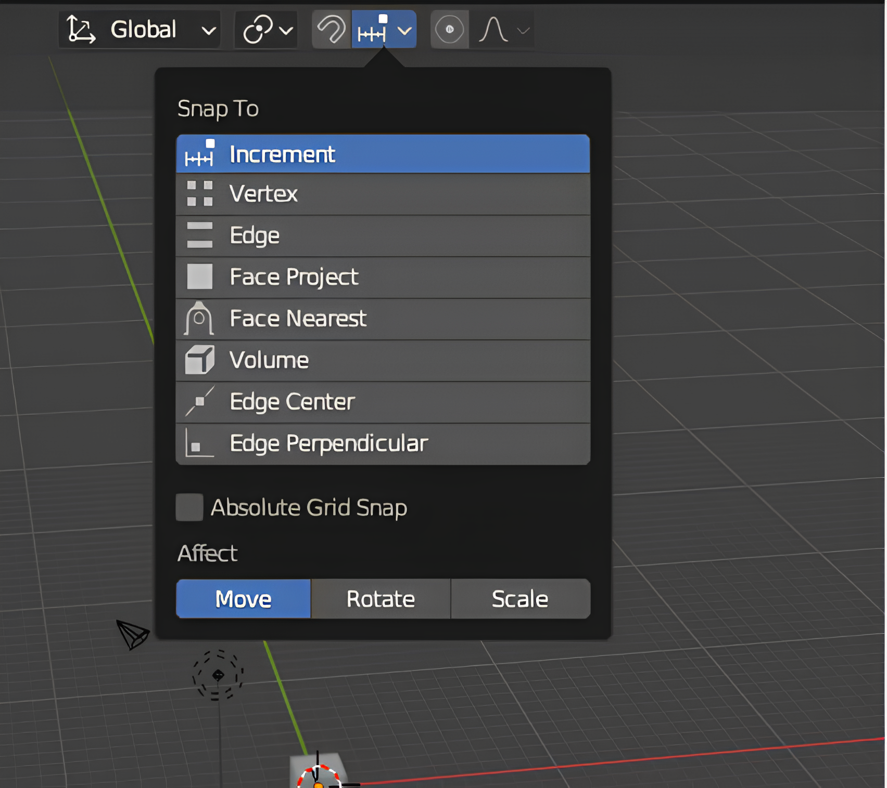

Snappingi açmak için mıknatıs sembolüne tıklayın mavi olarak işaretlendiğinde aktif olur.

Snapping hizalama işine yarar.

* Increment: Izgaraya göre hizalama.Yerdeki ızgaralara göre hizalama işlemi yapar sadece move açık bir birim bir birim ilerler.

 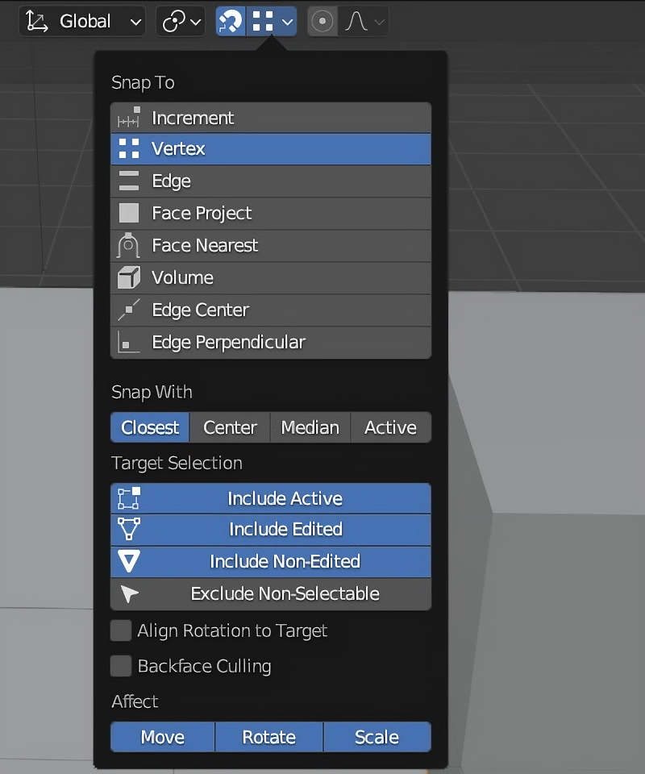

* Vertex: Diğer objelerin veya vertex’lerin uç noktalarına hizalama yapar.

* Edge: Kenarlara hizalama yapar. Yani, objenin bir kenarını başka bir objenin kenarına sabitleyebilirsiniz.

* Face: Yüzeylere hizalama yapar. Bu modda, bir yüzeyi başka bir yüzeye yerleştirebilirsiniz. Tam olarak yüzeye tutturma vs.

* Face Nearest kendisine en yakın yüzeye tutun.

* Volume: 3D hacme göre hizalama. Hacimlerin merkezi veya kenarlarına snap yapar. Rigleme işleminde

* Edge Center kenarının tam orta noktasına getirir.

* Egge Perpendicular bu özellikte seçtiğiniz noktanın diğer nesnenin yüzeyindeki en yakın noktaya snap ettirir.s

#### SNAP WİTH:
Closest (En Yakın): Objeyi hedef yüzeye mümkün olan en kısa mesafeden yapıştırır.

Center (Merkez): Objeyi, tam merkez noktasını hedef yüzeye yapıştıracak şekilde hizalar.

Median (Orta Nokta): Objenin geometrik orta noktasını hedef alır.

Active (Etkin): Seçili aktif objenin belirli bir noktasına odaklanır.

#### TARGET SECTİON

Include Active: Aktif olarak seçilen objeyi yapıştırma işlemine dahil eder. Bu, özellikle birden fazla obje üzerinde çalışıyorsanız ve belirli bir objeyi etkili şekilde hizalamak istiyorsanız faydalıdır.

Exclude Non-Selectable: Seçilemez olan objeleri yapıştırma işleminden hariç tutar. Bu, karmaşık sahnelerde gereksiz objelerin dikkate alınmamasını sağlar.

Backface culling: Bir nevi aç kapat snappingi.

Project individual elements: Birden fazla öğe seçince her öğe kendine göre yön tayin etmesini sağlar.

Shift tuşuna basarak hepsini seçebilir.

### Proportional Editing

Bu özellik sayesinde, bir vertex, edge ya da face'i hareket ettirdiğinde, etrafındaki diğer nesneler  de belirli bir etki alanı içinde  bir şekilde bu harekete katılır. 

 

* Bir vertex, edge ya da face seç.

* O tuşuna basarak Proportional Editing'i aktif et (aynı tuşla kapatılır).

* G (taşı), R (döndür), S (ölçek) gibi komutları kullan.

* Fare tekerleğiyle etki alanını büyütüp küçültebilirsin.

Ne zaman kullanılır?

1 Yüzeyleri doğal eğimlerle şekillendirmek.

2 Dağ, tepe gibi organik şekiller oluşturmak.

3 Karakter modellemede kas, yüz hatları gibi detayları düzenlemek.

### 1 numara Extrude Region (E)

 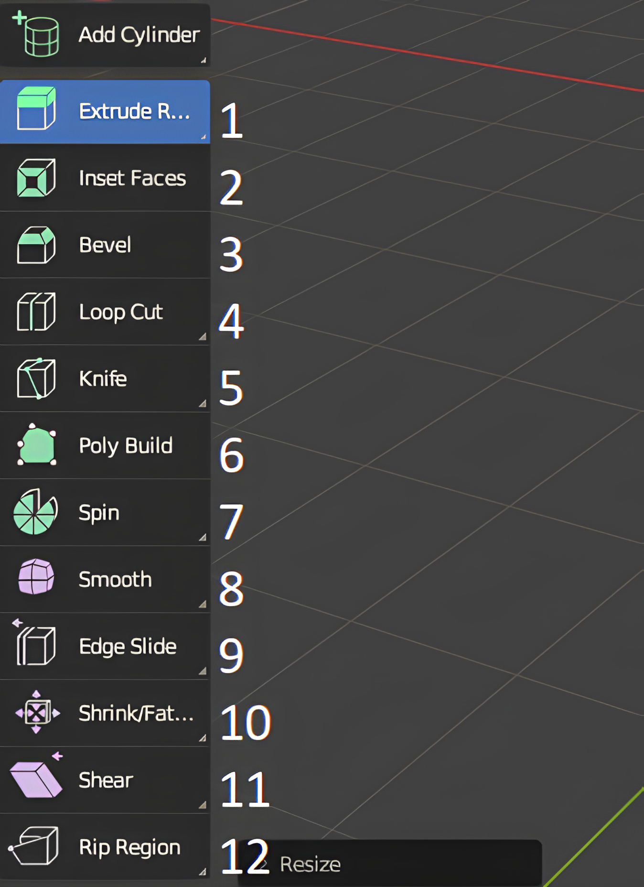

Exturede modu açmak için edit modda 1 numaralı kısma basılı tutun.

 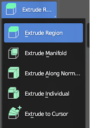

 :large_blue_circle:  Extrude Region (E) Seçilen geometriyi tek parça olarak dışa doğru uzatır.

 :large_blue_circle: Extrude Manifold Yüzeyleri extrude ederken gereksiz kenarları otomatik temizler.Topolojiyi bozmadan düzgün extrude yapmak için idealdir.Kesik/kırık mesh'lerde işe yarar.

 :large_blue_circle: Extrude Along Normals Birden fazla seçilen yüzeyleri kendi normallerindeki eksenlere göre extrude etmek için kullanır. Her bir yüzey kendine göre exturede olur.

 :large_blue_circle: Extrude to Cursor mouse imlecini parça parça tıklayarak uzattırma yapılabilir.

 ### 2 numara Inset 
Inset aracı, Blender’da modelleme yaparken yüzeylerin (faces) içine doğru yeni yüzeyler oluşturmanı sağlar.

 

 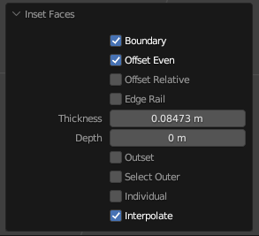

| Ayar / Kısayol       | Açıklama                                                                 |
|----------------------|--------------------------------------------------------------------------|
| `I`                  | Seçili yüzey(ler)i içe doğru inset yapar.                               |
| `I` + `I` (İki kez)  | Çoklu yüzeylerde her yüzey için ayrı ayrı inset yapılır (Individual).   |
| `Thickness`          | İnset mesafesini belirler (kenardan ne kadar içeride olacak).           |
| `Depth`              | Yüzeyi içeriye veya dışarıya doğru extrude benzeri bir hareketle iter.  |
| `Boundary`           | Sınırda bulunan yüzeylerin inset olup olmayacağını belirler.    Kısacak başka kenarla bağlantısı olmayan kenarı açarsan inset eder .        |
| `Outset`             | İçeri değil dışarı doğru inset yapar (büyütme gibi düşün).              |
| `Offset Relative`    | İnset oranını kenar uzunluğuna göre ayarlar. Daha düzgün bir geometri.                           |
| `Offset Even`    | Kalınlığı artırmayı sağlar.           |
| `Edge Rail`          |  Inset yapınca yüzeyin birebir aynı doğrultuda olmasını sağlar    |
|`Select Outer`| Inset edilen yüzeyin dışınaki yüzeyi seçmeyi sağlar.
| ` Individual` | Her yüzen kendi bulunduğu yerde Inset olur|

### 3 numara Bevel Aracı CTRL+B
Köşelere yuvarlaklık vermeyi sağlar.

 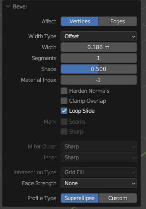

#### Affect (Etki Alanı):

* Vertices (Köşeler): Sadece köşeleri eğimlendirir. Kenarlar olduğu gibi kalır.

* Edges (Kenarlar): Kenarları eğimlendirir, bu da köşelerin de etkilenmesine yol açar. Şu anda "Vertices" seçili.

#### Width Type
 Verilen eğimlerin biriminin nasıl ölçüleceğini gösterir.

 *  Offset Mesafe ile ölç. Yeni oluşan eğimli yüzeyin orijinal kenardan olan mesafesini ifade eder.
 *  Width Toplam Genişlik ölçümü.
 *  Percent Yüzde değeri ile ölçme.
 *  Absolute Mutlak değer ile ölç.
 *  Depth Derinlik ile ölç.

 #### Segments (Segmentler): 
 
 Eğimli yüzey boyunca kaç tane alt  segment olacağını belirler. Daha fazla segment yuvarlaklığı artırır.

 #### Shape (Şekil): 
 
 Eğimin profilinin ne kadar içbükey veya dışbükey olacağını kontrol eden bir değerdir. 0.5 değeri dairesel bir eğim oluşturur. 0'a yakın değerler daha düz, 0'dan küçük değerler ise içbükey bir şekil verir. 

  #### Material Index (Materyal İndeksi): 
  Oluşturulan yeni eğimli yüzeylere hangi materyalin atanacağını belirler. Mataryalin buradan indeks numarasını girilir.

  **Harden Normals**: Etkinleştirildiğinde, eğimli yüzeylerin normal vektörleri komşu yüzeylere uyacak şekilde ayarlanır ve komşu yüzeylerin normalleri etkilenmez. Bu, komşu yüzeylerin düz kalmasını  ve eğimli yüzeylerin onlara yumuşak bir şekilde geçiş yapmasını sağlar. Smooth özelliğinin aynısıdır.

**Clamp Overlap**: Etkinleştirildiğinde, eğimli kenarların genişliği, diğer  çakışmaları önleyecek şekilde sınırlandırılır.

**Loop Slide (Döngü Kaydırma)**: Bir köşeye hem eğimli hem de eğimsiz kenarlar geliyorsa, eğimin mümkün olduğunca bu eğimsiz kenarlar boyunca kaymasını sağlar. Bu seçeneğin kapatılması daha eşit eğim genişliklerine yol açabilir.

#### Mark (İşaretle) Ayarları

**Seams Dikiş**: Etkinleştirilirse, yeni oluşturulan eğimli kenarlar UV açma işlemi için dikiş olarak işaretlenir.

**Sharp (Keskin)**: Etkinleştirilirse, yeni oluşturulan eğimli kenarlar keskin kenarlar olarak işaretlenir. Bu, gölgelendirme sırasında bu kenarların yumuşatılmamasını sağlar.
Miter (Gönye) Ayarları

Miter Outer (Dış Miter) Türleri:
1. Sharp (Keskin)
Köşeleri keskin bırakır, bevel’ler sadece birleşir.

Az poligonlu ve temiz görünür ama çok keskin köşelerde garip görünebilir.

2. Patch (Yama)
Köşeye ekstra yüzeyler ekleyerek orayı daha yumuşak bir geçişle doldurur.

Daha pürüzsüz görünüm sağlar, shading hatalarını azaltır.

3. Arc (Yay)
Köşeleri yay biçiminde, kıvrımlı bir şekilde birleştirir.

**Intersection Type (Kesişim Tipi)**: 

1. Grid Fill (Izgara Doldurma) 
Kesişim alanını düzgün bir ızgara yapısıyla doldurur.

Temiz ve düzenli topoloji üretir.

2. Cutoff (Kesim) ✂️
Kesişim bölgesini sert bir şekilde keser.

Karmaşık köşelerde bozulmalara ya da deliklere neden olabilir.

Bazen düşük poligonlu işler için tercih edilebilir.

**Face Strength**: Face Strength, bir yüzün “önem düzeyini” belirtir. Blender bunu “Weighted Normal” (Ağırlıklı Normaller) ile birlikte kullanır.
Bu sayede shading (gölgelendirme) düzgün görünür, özellikle sert kenarlar ve otomatik smoothing ayarlarında etkisini gösterir.

✅None
Bevel sonrası hiçbir yüz için özel bir güç seviyesi ayarlanmaz.

✅ New
Sadece yeni oluşturulan yüzler “Medium” seviyesinde atanır.

✅ Affect Only
Sadece zaten “Medium” veya “Strong” olan yüzler etkilenir.

✅ All
Tüm bevel sonucu yüzler “Medium” olur.

**Profile Type (Profil Tipi)**:

Superellipse: Hızlı ve kolay yumuşak bevel’ler. Sert ya da yumuşak geçişler için idealdir.

Custom: Karmaşık ve özgün geçiş isteyen modellerde — örneğin pencere çerçeveleri, özel kalıplar, dekoratif kenarlar vs.

### 7 numara Spin
Spin aracı, seçtiğin nesneyi bir eksen etrafında belirli bir açıyla ve belirli sayıda kopyalayarak döndürür. Böylece o eksen etrafında dönen bir şekil ortaya çıkar. O eksende 3D cursordür.

 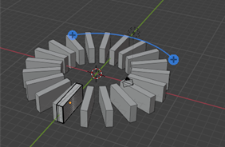

 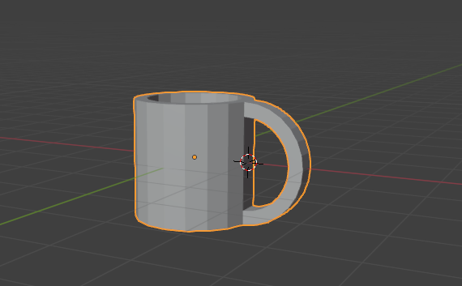

Bardak kulpu gibi nesneler oluşturulabilir.

 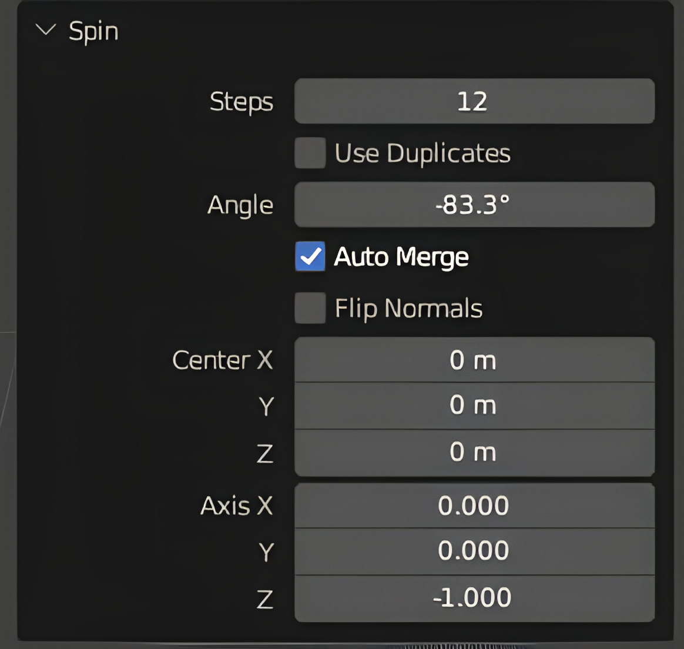

🔵 Steps (Adımlar): Bu değer, orijinal nesnenin kaç tane kopyasının oluşturulacağını belirler. Görseldeki örnekte 12 olarak ayarlanmış, yani orijinal nesne dahil olmak üzere toplamda 12 kopya (11 yeni kopya) oluşturulacak ve bunlar belirtilen açıya göre döndürülerek yerleştirilecektir.

🔵 Use Duplicates (Kopyaları Kullan): Bu seçenek işaretlendiğinde, döndürme işlemi sırasında orijinal nesnenin gerçek kopyaları oluşturulur. İşaretlenmediğinde ise, döndürme işlemi sadece orijinal nesnenin geometrisini deforme ederek bir "döndürülmüş" görünüm elde etmeye çalışır. Genellikle çoğaltma isteniyorsa bu seçenek işaretli bırakılır.

🔵 Angle (Açı): Bu, her bir adımda nesnenin ne kadar döndürüleceğini belirtir. Görselde -83.3° olarak ayarlanmış. Negatif değer, döndürme yönünün saat yönünün tersine olacağı anlamına gelir. Pozitif bir değer saat yönünde döndürme yapar. 

🔵 Auto Merge (Otomatik Birleştirme): Bu kutucuk işaretliyse, döndürme işlemi sonucunda üst üste gelen veya birbirine çok yakın olan noktalar otomatik olarak birleştirilir. Bu, özellikle kapalı ve düzgün yüzeyler oluşturmak istendiğinizde faydalıdır (örneğin bir vazo veya silindir oluştururken).

🔵 Flip Normals (Normalleri Çevir): Nesnelerin yüzeylerinin "dışarı" veya "içeri" baktığını belirleyen normal vektörleri vardır. Bu seçenek işaretlendiğinde, oluşturulan kopyaların normal vektörleri ters çevrilir. 

🔵 Center (Merkez): Bu bölüm, döndürme işleminin hangi nokta etrafında gerçekleşeceğini belirler. X, Y ve Z değerleri, global koordinat sisteminde veya nesnenin kendi yerel koordinat sisteminde (bağlı olduğu nesneye göre) döndürme merkezinin konumunu ifade eder. 

🔵 Axis (Eksen): Bu bölüm, döndürme işleminin hangi eksen etrafında gerçekleşeceğini belirler. X, Y ve Z değerleri, döndürme ekseninin yönünü tanımlayan bir vektördür. Görselde X ve Y 0.000, Z ise -1.000 olarak ayarlanmış. 

### 8 numara Smooth & Randomize

🔵 Smooth (Yumuşatma):  Gismoyu Yüzey üzerinde hareket ettirdikçe, yakındaki noktaların konumlarını ortalayarak daha akıcı ve düzgün bir görünüm elde etmenizi sağlar. Özellikle detay ekledikten sonra yüzeyi genel olarak pürüzsüzleştirmek veya hatalı bölgeleri düzeltmek için sıkça kullanılır.

🔵 Randomize (Rastgeleleştirme): Bu fırça ise yüzeydeki noktaların konumlarını rastgele bir şekilde değiştirir. Bu, yüzeye doğal olmayan, düzensiz bir doku veya bozulma efekti vermek için kullanılabilir. Örneğin, kayalık bir yüzey oluştururken veya bir nesnenin yıpranmış görünmesini sağlarken faydalı olabilir.

### 9 numara Slide
 

Edge slide :
Bir kenarı, bağlı olduğu geometri boyunca kaydırmanı sağlar. Yani “kenarı tut, yerini değiştir ama yüzeyi bozmadan” hareket ettir.

Vertex Slide :Benzer mantık, ama vertex (nokta) için. Yani vertex’i, bağlı olduğu kenar veya yüzey boyunca kaydırmak.

 ### 10 Edge & Vertex Slide
 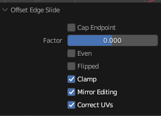

 
 bir kenar ve nokta arasında kaydırma işlemi yapmımızı sağlıyor. 

🔵 Even E Kenar döngüsünü komşu kenar döngüsünün şekliyle eşleşecek şekilde zorlar. F tuşuna basarak karşıt köşeye geçebilirsiniz.

🔵 Flipped F karşısındaki kenarların doğrultusunda yapıyor.

🔵 Clamp Alt veya C Kaydırmayı kenar sınırları içinde sabitlemeyi açıp kapatır.

🔵 Factor Gerçekleştirilen kaydırma miktarını belirler. Negatif değerler bir yüze doğru kaydırmalara, pozitif değerler ise diğerine atıfta bulunur.

🔵 Mirror Editing İşlemi ağın simetrik elemanlarına (varsa, yerel X yönünde) yaymanıza olanak tanır.

🔵 Correct UVs Eğer mevcutsa, görüntü bozulmalarını önlemek için ilgili UV koordinatlarını düzeltir.

### 10 numara  Shrink/Fatten 

Seçili yüzeyleri yüzey normalleri boyunca içeriye ya da dışarıya doğru hareket ettirmeni sağlar. Özellikle kalınlık verme ya da yüzeyleri genişletip daraltmak için çok kullanışlıdır.

Shrink (Daralt): Yüzeyleri içeri doğru çeker.

Fatten (Şişir): Yüzeyleri dışarı doğru iter.

Bu işlem "normale göre" çalışır. Yani her yüzey kendi yönüne göre hareket eder.

📌 Kısayol:
Alt + S tuşlarına bastığında aktif olur.

 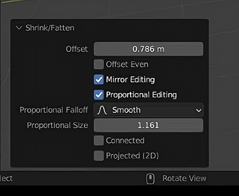

🔹 Offset
Ne kadar şişirileceğini veya daraltılacağını belirler.

Pozitif değer: Dışa doğru (şişirme)

Negatif değer: İçe doğru (daraltma)

🔹 Offset Even
Hareketin her yönde eşit olmasını sağlar.

Bu sayede yüzeyler daha düzgün şişirilir.

🔹 Mirror Editing
Eğer aynalama (Mirror Modifier) kullanıyorsan, düzenlemeyi ayna tarafına da otomatik uygular.

X aynası gibi davranır.

🔹 Proportional Editing
Etrafındaki vertex’leri de yumuşak bir şekilde etkiler.

Bu sayede geçişler daha organik olur.

🔹 Proportional Falloff (Smooth)
Etki şekli: Smooth, Sharp, Root, Linear, Constant gibi seçenekler sunar.

Smooth, en yaygın ve yumuşak geçiş sağlayandır.

Başka bir deyişle: Değişiklik merkeze yakın vertex'leri daha fazla, uzaktakileri daha az etkiler.

🔹 Proportional Size
Etki alanının çapı (mouse tekerleği ile sahnede ayarlanabilir)

Yani bu sayı arttıkça, daha fazla vertex etkilenir.

🔹 Connected
Sadece birbirine bağlı vertex’lerin etkilenmesini sağlar.

Parçalanmış mesh’lerde çok işine yarar.

🔹 Projected (2D)
2D ekran görünümüne göre etkiler.

Özellikle plan görünümlü çalışmalarda kullanılabilir.

