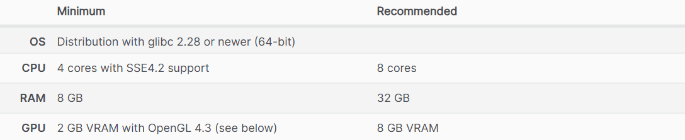
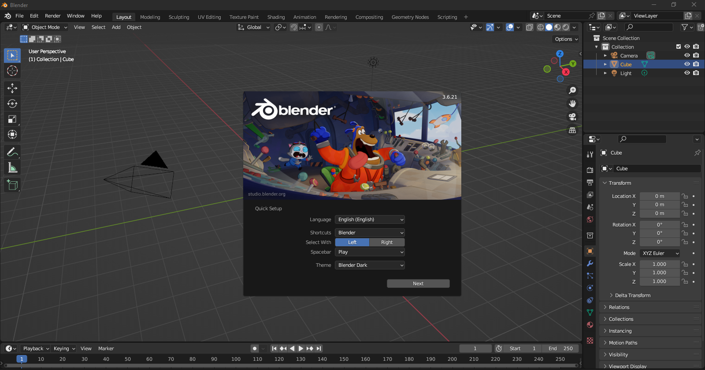
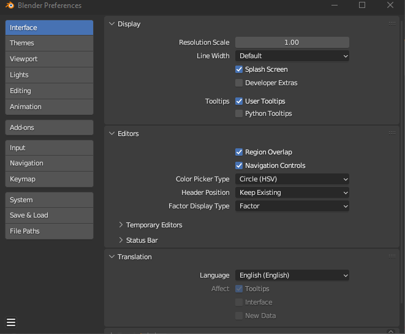
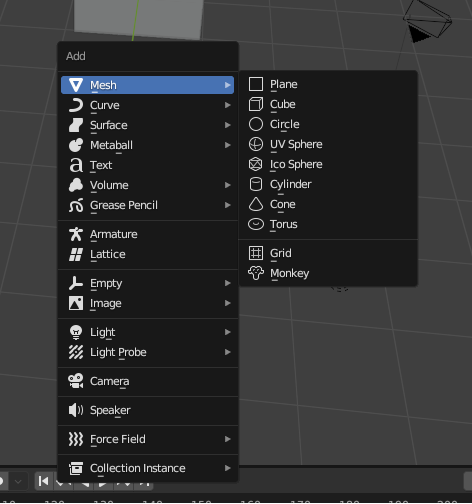
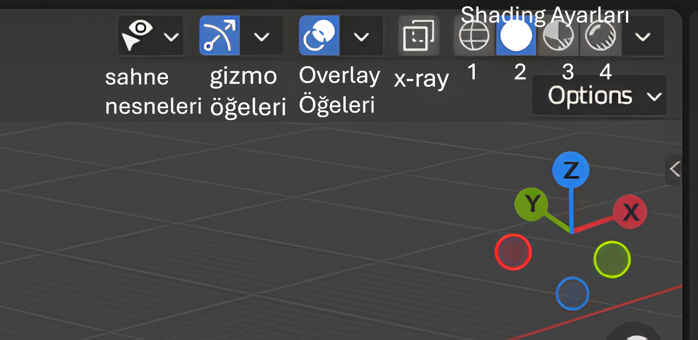
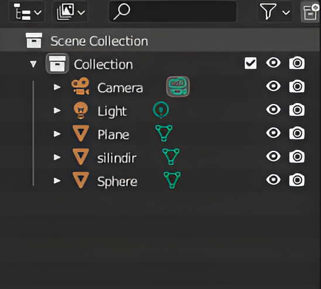
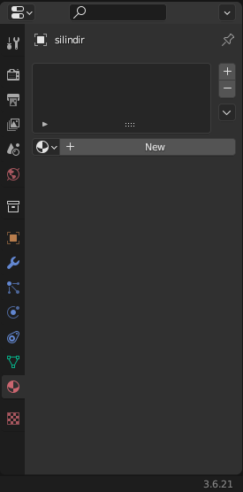
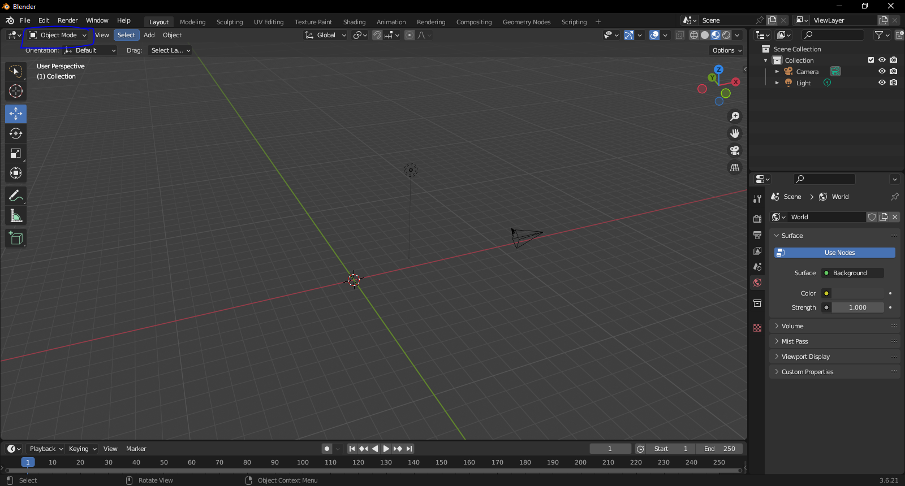
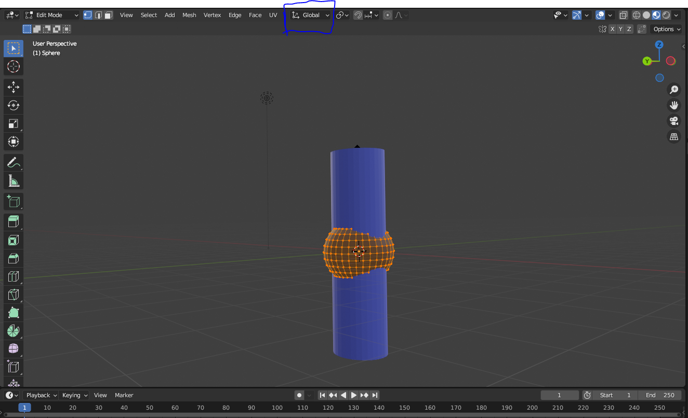
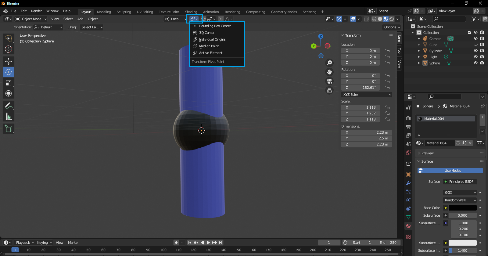

# Blender Arayüz 
### Giriş
 Blender özgür,açık kaynak kodlu 3D modelleme aracıdır. 

 Neler yapılabilir:

1. 3D modelleme
2. animasyon, 
3. görsel efektler (VFX), 
4. Simülasyonlar,
5. Oyun geliştirme ve render işlemleri 

Kurulum

https://www.blender.org  websitesinden güncel kurulumları yapabilirsiniz.

Windows için sistem gereksinimleri:

Linux

----
Kurulum işlemi tamamlandıktan sonra ortalama şöyle bi ekranla karşılacaksınız.

1. dil ayarı 
2. Kısayol ayarları
3. Mouse hangi tuşuyla
4. Boşluk tuşuna basınca ne yapılmalı burda play animasyonu oynatın demek.
5. Tema seçimi.

EditBlender/ Preferences Preferences.PNG

1. Arayüzü değiştirebildiğimiz kısım
2. Temayı (dark mode ,yazı stilleri vs) ayarlandığı kısım
3. Add-ons blenderda birçok eklenti vardır bu kısımdan eklenti ekleyip çıkarabiliriz.
4. Save load kısmından kaç dakikada bir save alınacağı ayarlanabilir.

Kısayollar:

Görünüm ve Kamera:

1. Numpad 1: Ön görünüm

2. Numpad 3: Sağ görünüm

3. Numpad 7: Üst görünüm

4. Numpad 5: Perspektif/görünüm modu değiştir

5. Numpad 0: Kameradan görünümü aktif et

6. shift+mouse :tekerliğine basarsanız  sahnede istediğiniz yere doğru hareket edebilrisiniz

7. Mouse tekerleği: ile sahne etrafında dönebilirsiniz.

Nesne taşıma:

1. G: Nesneyi taşı (Grab)

2. G+Y : Y ekseninde nesneyi taşı.

3. G+X : X ekseninde nesneyi taşı.

4. G+Z : Z ekseninde nesneyi taşı.

5. G+CTRL: Birim birim taşı.

Nesne  döndürme:

1. R: Döndürme (Rotate).

2. R+Y : Y ekseninde nesneyi döndür.

3. R+Z : Z ekseninde nesneyi döndür.

4. R+X : X ekseninde nesneyi döndür.

Nesne  Boyutlandırma:

1. S: Nesneyi boyutlandır (Scale)

2. S+Y : Y ekseninde nesneyi boyutlandır.

3. S+X : X ekseninde nesneyi boyutlandır.

4. S+Z : Z ekseninde nesneyi boyutlandır.

Tüm bunları  N ile panelini açıp yapabilirsiniz.

Nesne  isimlendirme:

f2 tuşuna basıp kısaca isimlendirme yapılabili.

Nesne Ekleme ekranı 

Yukardan  add kısmından yada shift+a kombinasyonuna basarsanız nesne ekleme menüsü açılır.

### 3D CURSOR

Blender ekranında bu şekilde gözüken yapıya 3D cursor denir.

* Blender’da sahneye bir nesne eklediğinde, bu nesne varsayılan olarak 3D Cursor’un bulunduğu konumda oluşturulur.

* 3D Cursor, aynı zamanda döndürme, ölçekleme ve hizalama işlemlerinde pivot (merkez) noktası olarak da kullanılabilir

Shift+s tuşuna basarsanız cursorın menüsü ekrana gelir bu ekrandan cursor ile alakalı işlemleri kısayollardan halledebilirsiniz.

1.  Numara Cursoru sahnenin orjinine getirir.
2.  Seçilen nesnenin merkezine getirir.
3. Bir veya daha fazla nesne (veya vertex, edge, face) seçtiğinde, "aktif olan", yani en son seçtiğin öğe olur.
"Cursor to Active", işte bu aktif öğenin merkezine 3D Cursor'u taşır.
5. Diyelim ki cursor bir vertex'e veya nesneye göre ayarlandı ama küsüratlı koordinatlarda duruyor,Eğer 3D Cursor'u en yakın grid noktasına (tam sayı gibi) hizalamak istersen kullanırsın.
5.
6. Seçilen nesneleri grid'e hizalar. Alttaki ızgaralara denk gelecek şekilde ayarlar
7. Cursor’a taşır ama  mesafeyi korur. Birden fazla nesneyi taşırken şeklin bozulmasını engeller.
8. Seçilen nesneyi cursorün bulunduğu yere getir.

## Gizmo ve Overlays
**Overlay**

 Overlay Nedir?
Overlay terimi, Blender’da sahnede görünen bazı görsel yardımcı araçları ifade eder. Bu araçlar, sahnede çalışma yaparken yardımcı olur ve daha fazla kontrol sağlar. Overlay'ler, ekstra bilgilere ve görsel rehberlere ulaşmanı sağlar.

Overlay’in Kapsadığı Öğeler:

-  Mesh Görünümü (Wireframe/Surface): Modelin üzerindeki poligonları, kenarları ya da yüzeyleri gösterebilir.

- Grid/Izgara: Sahnede yer alan grid ve ızgara çizgilerinin görünürlüğünü kontrol eder.

- Object Origins: Nesnelerin başlangıç noktalarının (origin) görünürlük ayarlarını kontrol eder.

- Normals: Nesnelerin yüzey normal çizgilerini (yüzey yönünü gösterir) görmek için kullanılır.

- Edge Lengths: Kenar uzunluklarını gösterir.

- Annotations: Çizimler, notlar ekleyebilirsin.

**Gizmo**

Gizmo, Blender’da nesneleri etkileşimli olarak taşımanızı, döndürmenizi ve ölçeklendirmenizi sağlayan görsel araç kümesidir. Gizmo’lar, manipülasyon işlemlerini kolaylaştırır.

Nesnenin, objenin veya seçim kutusunun etrafındaki görsel kılavuzlar (oklar ve çubuklar) etkileşime girerek nesneleri hareket ettirmeni sağlar.

Gizmo’a Ait Temel Araçlar:

* Move Gizmo (Taşıma): Yön oklarıyla nesneyi X, Y ve Z eksenlerinde hareket ettirmeni sağlar.

* Rotate Gizmo (Dönme): Nesneyi X, Y ve Z eksenlerinde döndürmek için dairesel oklar kullanır.

* Scale Gizmo (Ölçek): Nesnenin boyutlarını X, Y ve Z eksenlerinde değiştirmek için kullanılabilir.

**Shading**

Shading, Blender gibi 3D yazılımlarında bir modelin yüzeyine nasıl ışık düşeceğini ve nasıl görüneceğini belirleyen bir tekniktir. Yani, shading bir nesnenin ışık ve gölge oyunlarıyla nasıl görüneceğini ayarlamaya yarar.

Blender'da shading ile ilgili genelde iki ana şey konuşulur:

Nesnelerin ışıkla nasıl etkileşime gireceği (Yüzey gölgeleme).

Şekillerin ve materyallerin görünümünü ayarlama.

Sahne nesnelerinden sahne üzerinde istediğiniz türden öğelerin görünümünü kapatabilirsiniz.

* Gizmo Öğelerinden gizmoyla alakalı yerleri kapatabilirsiniz.

* Overlay Öğeerinden overlay ile alakalı yerleri kapatabilirsiniz.

* X-ray açarak nesnelerin arka tarafının görünmesini sağlayabilirsiniz.

* Shading Ayarları

   1. Nesnelerin bağlantı noktalarını gösteren kısmı açar. Bu ayarda nesne bağlantılarında problem olup olmadığını algılanır.
   2.  Mataryalsiz ham halinin gözükmesini seçer.
   3. Mataryal ile birlikte görünmesini gösterir.
   4. Işığa nesnenin nasıl tepki verdiğini gösterir.

---

Burası hiyerarşi kısmı buradan sahneye eklenen nesneleri görebilirsiniz.

 
 Hemen altındaki bu kısım nesnelerin özelliklerini gösteren kısımdır.

 Blenderda birden fazla mod bulunmaktadır.

 ## BLENDER MODLARI

 

***Mavi ile işaretlenmiş yerden modları değiştirebiliyoruz.***

### Modlar:

| **Mod Adı**              | **Ne Yapar?**                                                                                                                                         | **Ne Zaman Kullanılır?**                                                            |
|--------------------------|------------------------------------------------------------------------------------------------------------------------------------------------------|--------------------------------------------------------------------------------------|
| **Object Mode**  | Nesneleri taşır, döndürür, ölçeklendirir.| Nesnelerle temel işlem yapmak için.                                                 |
| **Edit Mode**             | Nesnenin vertex, kenar ve yüzeylerini düzenler.| Modelleme , detaylı düzenlemeler ve şekil vermek için.                                             |
| **Sculpt Mode**           | Modeli heykel gibi |  Organik şekiller, karakterler veya karmaşık yüzeyler oluştururken kullanılır.                                     |
| **Vertex Paint Mode**     | Nesnenin vertex'lerine renk ekler.| Nesnenin renk detaylarını düzenlerken ve dokusunu oluştururken kullanılır.                                             |
| **Weight Paint Mode**  | Rigging (kemik sistemi) sırasında kemiklerin ağırlıklarını düzenler.   | Karakter rigging ve animasyonlarında.                                               |
| **Texture Paint Mode**    | Modelin yüzeyine doku ekler ve bu dokuları fırça ile boyar.                                                                                          | Modelin üzerine renk ve desen eklemek için kullanılır.                             |
|

### EDİT MODE

| **Kısayol**        | **İşlevi**                                |
|--------------------|-------------------------------------------|
| `Tab`              | Object ↔ Edit Mode geçişi                 |
| `1` / `2` / `3`    | Vertex / Edge / Face seçim modları       |
| `A`                | Hepsini seç veya seçimi kaldır            |
| `B`                | Box Select (dikdörtgen seçim)             |
| `C`                | Circle Select (daire seçim)               |
| `L`                | Hoverlanan parçayı seç                    |
| `Ctrl + L`         | Seçili vertex'e bağlı tüm parçaları seç   |
| `X` / `Delete`     | Silme seçenekleri                         |
| `E`                | Extrude (çıkıntı oluştur)                 |
| `I`                | Inset (içe yüzey)                         |
| `F`                | Yüzey oluştur                             |
| `M` / `Alt + M`    | Merge (birleştir)                         |
| `G`                | Taşı (Grab)                               |
| `R`                | Döndür (Rotate)                           |
| `S`                | Ölçekle (Scale)                           |
| `Ctrl + R`         | Loop Cut (kenar boyunca kesme)           |
| `Ctrl + B`         | Bevel (kenar yumuşatma)                  |
| `K`                | Knife Tool (kesme aracı)                 |
| `Alt + S`          | Normale göre ölçekle                     |
| `Shift + D`        | Kopyala (Duplicate)                      |
| `Alt + D`          | Bağlı kopya (Linked Duplicate)           |
| `P`                | Seçimi ayrı nesne yap (Separate)         |
| `Shift + S`        | Snap menüsü                              |
| `.` (nokta)        | Pivot Point ayarı                        |
| `O`                | Proportional Editing aç/kapat            |
| `H` / `Alt + H`    | Gizle / Göster                           |
| `Ctrl + F`         | Yüzey menüsü                             |
| `U`                | UV Mapping menüsü                        |

### Transform Orientations

Transform Orientation (Dönüştürme Yönelimi), nesneleri veya vertex/edge/face’leri taşırken (G), döndürürken (R) ya da ölçeklerken (S) hangi yönü referans alacağını belirler.

 

| **Orientation** | **Açıklama**                                                                 |
|------------------|------------------------------------------------------------------------------|
| **Global**       | Dünya eksenlerine göre (X, Y, Z)                                             |
| **Local**        | Nesnenin kendi yönelimine göre (nesne döndürülmüşse eksen de döner)         |
| **Normal**       | Seçili yüzeyin veya vertex'in yüzey normallerine göre yönlenir              |
| **Gimbal**       | Rotasyon açılarının (Euler) matematiksel görünümünü verir (animasyon için)  |
| **View**         | Kameranın (bakış açısının) yönüne göre                                      |
| **Cursor**       | 3D Cursor yönelimi baz alınır                          |
| **Custom**       | Kendi özel yönelimini tanımlayarak kullanabilirsin                          |

### Pivot Point

Blender'da Pivot Point, bir nesneyi döndürürken (R), ölçeklerken (S) veya başka bir dönüşüm yaparken referans alınacak merkezi belirler.

 

| **Pivot Türü**          | **Açıklama**                                                                 |
|--------------------------|------------------------------------------------------------------------------|
| **Bounding Box Center**  | Seçilen nesne veya elemanların kutu gibi çevresini sarar, ortasını referans alır |
| **Median Point**         | Seçimin ağırlıklı (ortalama) merkezini referans alır(sağ ve solda nesneler var dersek en çok nesnenin olduğu tarafı referans alır.)                          |
| **Individual Origins**   | Her nesne veya parçanın kendi merkezine göre işlem yapılır                    |
| **3D Cursor**            | Dönüşüm 3D Cursor noktasına göre yapılır                                     |
| **Active Element**       | Seçimdeki aktif (en son seçilen) elemana göre dönüşüm yapılır.(Genellikle rengi farklıdır.)               |

***NOT:NUMPAD ALTINDAKİ VİRGÜL NESNEYE YAKINLAŞMAYI SAĞLAR.**