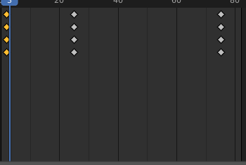

BLENDERDA ANİMASYON
Öncelikle bilmemiz gereken **KeyFrame**

Blender’da animasyonun temeli keyframe’lere dayanır. Bir nesnenin belirli bir anda konumunu, rotasyonunu, ölçeğini veya başka bir özelliğini kaydetmek için keyframe kullanılır. Blender, bu keyframe'ler arasında geçişler oluşturarak hareketi üretir.

 

Zaman Çizgisi (Timeline) ve Dope Sheet

Timeline:  Keyframe eklemek, silmek veya konumlarını değiştirmek için kullanılır.

Dope Sheet: Daha karmaşık projelerde, birden fazla nesnenin animasyonlarını yönetmek için kullanılır. Her objenin keyframe’leri detaylı şekilde burada görülür.

 

Kırmızı ile işaretlenmiş yerden modu değiştireblirsiniz.

 

1. Oynatma Kontrolleri: Bu bölüm, animasyonunuzu oynatmanıza ve kontrol etmenize yarayan düğmeleri içerir.
soldan sağa doğru 

     ⭐ Başa Git: Animasyonu ilk kareye (Başlangıç karesi) geri sarar.
 
     ⭐ Önceki Kare: Animasyonda bir önceki kareye gider.

     ⭐ Oynat/Durdur: Animasyonu başlatır veya durdurur.

     ⭐ Sonraki Kare: Animasyonda bir sonraki kareye gider.

     ⭐ Sona Git: Animasyonu son kareye (Bitiş karesi) ilerletir.

     ⭐ Yanındaki açılır menü, oynatma yönünü (ileri/geri) ve döngü seçeneklerini kontrol etmenizi sağlar.

2. Zaman Çizelgesi Ayarları: Bu bölüm, animasyonun zaman aralığını ve geçerli kareyi gösterir ve ayarlamanıza olanak tanır.

Geçerli Kare Numarası: Şu anda hangi karede olduğunuzu gösterir (şu anda "0"). Bu değeri doğrudan değiştirerek farklı karelere gidebilirsiniz.
Başlangıç (Start): Animasyonun başlayacağı kare numarasını belirtir (şu anda "0").
Bitiş (End): Animasyonun sona ereceği kare numarasını belirtir (şu anda "250"). Bu değerleri değiştirerek animasyonun oynatma aralığını daraltabilir veya genişletebilirsiniz.
3. Anahtar Kare Görüntüleme Alanı (Timeline): Bu, animasyon verilerinizin görsel olarak temsil edildiği ana bölümdür.

Yatay Çizgiler: Her bir animasyonlu özellik (örneğin, "Location X", "Rotation Z") için ayrı bir satır bulunur.
Elmas Şeklindeki İşaretler (Anahtar Kareler): Her bir satır üzerindeki bu işaretler, ilgili özelliğin o karedeki değerini temsil eden anahtar karelerdir.
Dikey Çizgiler: Zamanı (kareleri) gösteren çizgilerdir.
Oynatma Çubuğu (Mavi Dikey Çizgi): Animasyonun şu anda hangi karesinde olduğunu gösterir. Bu çubuğu sürükleyerek farklı kareleri inceleyebilirsiniz.
4. Özellik Listesi: Bu bölüm, animasyonlu nesnelerinizi ve bu nesnelerin animasyonlu özelliklerini listeler.

Summary: Tüm animasyonlu nesnelerin ve özelliklerinin genel bir özetini gösterir.
Cube: Şu anda seçili olan "Cube" adlı nesneyi gösterir. Yanındaki ok işaretiyle bu nesnenin animasyonlu özelliklerini genişletebilirsiniz.
CubeAction: "Cube" nesnesine atanmış olan animasyon eyleminin adıdır.
Object Transforms: Küpün konum, döndürme ve ölçek gibi temel dönüşüm özelliklerini içeren bir gruptur. Bu grubun yanındaki ok işaretine tıklayarak X, Y, Z eksenlerindeki ayrı animasyon verilerini görebilirsiniz.
Yanlarındaki göz simgeleri, ilgili animasyon verilerinin zaman çizelgesinde (bölüm 3) görünüp görünmeyeceğini kontrol eder.
Yanlarındaki ok simgeleri, ilgili animasyon verilerini genişletip daraltır.
Yanlarındaki seçim kutucukları, ilgili animasyon verilerini seçmenizi sağlar.