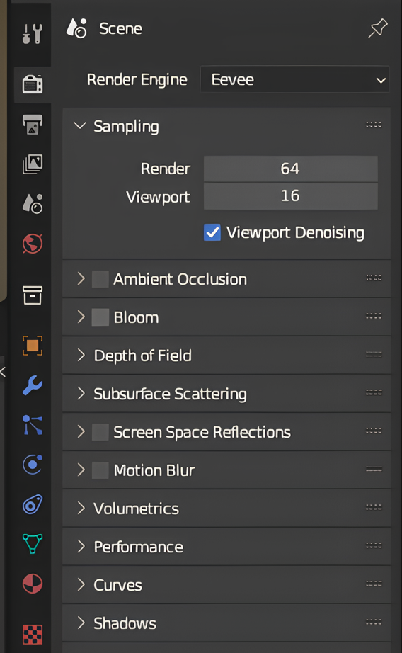
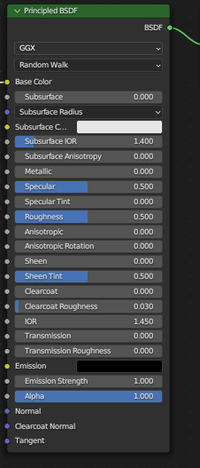

# BLENDER MATERİAL

 

Buradaki menüden en alt ikinci sıradaki material ekleme işini yapmaktadır.(Kırmızı top)

 

ekledikten sonra üst menüden shadinge geçmek gerekiyor buradan metarial ekranınını detaylı görebilirsiniz. Metaryal modunu açmayı unutmayın.
1. ☑️ Base Color (Temel Renk):
Nesnenin ana rengidir. 

2. ☑️ Subsurface:
Yüzeyin içine ışığın ne kadar girdiğini kontrol eder. Düşükse yüzey sert, yüksekse yumuşak görünür (insan cildi gibi). Genellikle nesneyle aynı renkte olması gerektiği söylenir.

3. ☑️ Subsurface Radius:
 Işığın yüzeyin altında ne kadar derine nüfuz edeceğini ve ne kadar geniş bir alana yayılacağını kontrol eden renk değerleridir.

4. ☑️ Subsurface Color:
Alt yüzey saçılımında görülen iç renk. (Örneğin cildin iç rengi kırmızımsı olabilir.)

5. ☑️ Subsurface IOR (Kırılma İndeksi):
Işığın yüzeye çarptığında nasıl büküleceğini belirler. 

6. ☑️Subsurface Anisotropy:
0.0 değeri her yöne eşit saçılma yaparken, pozitif veya negatif değerler belirli bir yönde daha fazla saçılma olmasına neden olur.

7. ☑️Metallic:
0 → Metal olmayan yüzey (örneğin tahta, plastik)
1 → Metal yüzey (örneğin çelik, altın)

8. ☑️Specular(Parlaklık):
Yüzeydeki yansımanın yoğunluğunu belirler. (0 → donuk yüzey, 1 → parlak yüzey)

9. ☑️Specular Tint:
Yansıyan ışığın Base Color'a göre renklendirilip renklendirilmediğini ayarlar.

10. ☑️Roughness (Pürüzlülük):
Yüzeyin pürüzlülüğünü ayarlar.
    - 0: Ayna gibi yansıtıcı.
    -   1: Mat ve dağınık yansıtıcı.

11. ☑️Anisotropic:
Yüzeydeki parlak yansımaların şeklini kontrol eder. 0.0 değeri izotropik (yuvarlak) yansımalar üretirken, pozitif veya negatif değerler yönlü, elips şeklinde yansımalar oluşturur 

12. ☑️Anisotropic Rotation:
Anisotropi efektinin yönünü değiştirir.

13. ☑️Sheen:
Yüzeyin kenarlarında görünen yumuşak, kadifemsi bir parlaklık efekti ekler. Kumaş veya kadife gibi malzemeler için kullanışlıdır.

14. ☑️Sheen Tint:
Sheen efektinin rengini Base Color'a mı yoksa beyaza mı çekeceğini ayarlar.

15. ☑️Clearcoat:
Yüzeyin üzerine ekstra bir şeffaf parlak katman ekler (araba boyasını cilalıyorlar gibi).

16. ☑️ Clearcoat Roughness:
Clearcoat tabakasının pürüzlülüğünü ayarlar.

17. ☑️ IOR (Index of Refraction - Kırılma İndeksi):
Saydam malzemelerde ışığın nasıl kırıldığını belirler.
(1.45, cam ya da plastik benzeri malzemeler için uygundur.)

18. ☑️ Transmission:
      0 → Opak (ışık geçirmez)
      1 → Tam şeffaf (cam gibi) hale getirir.

19. ☑️ Transmission Roughness:
Şeffaf yüzeyde ışığın dağılmasını kontrol eder. (Buzlu cam efekti.)

20. ☑️ Emission Strength:
Materyalin kendi ışık yayma kuvveti. (Örneğin neon lambalar.)

21. ☑️ Alpha:
Şeffaflık değeri.

    - 1 → Tam opak.

    - 0 → Tam saydam.

Normal Girişleri (Alttaki gri pinler)

☑️ Normal:
Yüzey normallerini değiştirmek için (bump map veya normal map bağlarsın).

☑️ Clearcoat Normal:
Clearcoat katmanı için özel bir normal map.

☑️Tangent:
Anisotropic efektler için özel yüzey yönlendirme.

