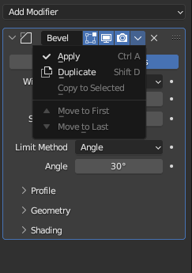
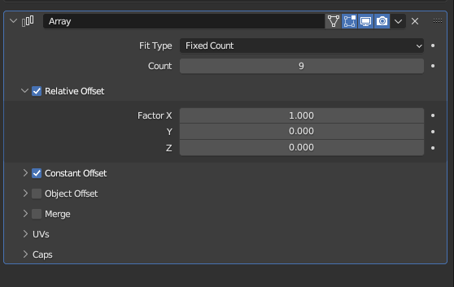
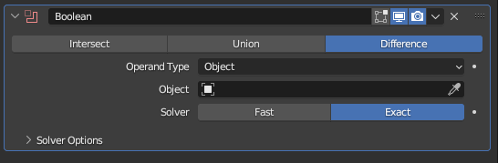
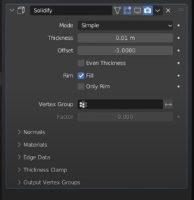

## MODİFİERS

Objeyi doğrudan değiştirmeden üzerine etkiler ekleyebilirsin. **Birden fazla modifiers eklersen sıralamaya göre çalışmaktadır. En üsten en altta gibi çalışabilir.**

Modifiersarı uygularsanız şekil öyle kalır birdaha değiştirmezsiniz modifersları.

Uygulama işlemi için herhangi bir modifers ekleyin.

 

Aşağıdaki menüden apply basarsanız uygulanır şekil böyle kalır.

 

Monitör ikonu modiferın etkisini kapatır. 
Kamera renderda kapatır. 
Sondaki edit modda modifierın görünüp görünmeyeceğini gösterir.
Bazen ücçgen şeklide gelir oda edit modda istediğin şekilde değişebileceğini gösterir.

🔧 MODIFY (Düzenleme Odaklı Modifier'lar) 

Genellikle nesnenin geometrisini doğrudan etkilemeyen modifierslardır.
Data Transfer: Bir objeden diğerine vertex, edge, normal gibi verileri aktarır.

Mesh Cache: Dışarıdan gelen bir animasyon datasını objeye uygular (örneğin .mdd, .pc2 formatları).

Mesh Sequence Cache: Birden fazla mesh dosyasını zamanla sırayla göstererek animasyon yaratır (Alembic formatı gibi).

Normal Edit: Normal (yüzey yönü) verilerini düzenlemeni sağlar, shading üzerinde etkilidir.

Weighted Normal: Normal yönlerini ağırlıklandırarak shading'i geliştirir (örneğin hard surface modellerde).

UV Project: Kameraya göre UV yansıması yapar (kamera projektörü gibi).

UV Warp: UV haritasını bir boş objeyle (empty) hareket ettirebilir veya döndürebilir.

Vertex Weight Edit: Vertex gruplarındaki ağırlıkları düzenlemene yarar.

Vertex Weight Mix: İki vertex grubunun ağırlıklarını karıştırır.

Vertex Weight Proximity: Diğer bir objeye olan uzaklığa göre vertex ağırlığı oluşturur.

🧱 GENERATE (Yeni Şekil ve Yapı Üreten Modifier'lar) Objenin genel görünümünü ve geometrisini değiştirir. Yapıcı ve yıkıcı etkileri bulunmaktadır. Bir nevi mevcut geometriden yeni geometri oluşturan veya çoğaltan modifiye edicileri içerir. 

### 🔷 Array Modifiers
 
  Objeyi belirli eksenlerde çoğaltır.

 

🔴 Fit Type (Uydurma Tipi): Bu bölüm, dizinin kaç kopya içereceğini veya belirli bir uzunluğa nasıl sığdırılacağını belirler.

1. Fixed Count (Sabit Sayı): Diziye eklenecek kopya sayısını doğrudan belirtmenizi sağlar. Altındaki Count (Sayı) değeri şu anda 9 olarak ayarlanmış, yani orijinal nesne dahil olmak üzere toplam 9 kopya oluşturulacak.

2. Fit Length (Uzunluğa Sığdır): Dizinin toplam uzunluğunu belirtirsiniz ve Blender, belirtilen uzunluğa sığacak kadar kopya oluşturur.

3. Fit Curve (Eğriye Sığdır): Bir eğri nesnesi oluşturursanız (shift+a curve seçecneği ile) ve kopya sayısı eğrinin uzunluğuna göre ayarlanır.
Relative Offset (Göreli Öteleme): Bu seçenek işaretliyken, her bir kopya orijinal nesnenin boyutuna göre ötelenir.

Factor X, Y, Z: Bu değerler, her bir kopyanın X, Y ve Z eksenlerinde ne kadar ötelenmesi gerektiğini belirler. 

Şu anda:
Factor X: 1.000: Her kopya, orijinal nesnenin X eksenindeki boyutu kadar sağa (eğer nesnenin X boyutu pozitifse) ötelenir.
Y: 0.000: Y ekseninde herhangi bir öteleme olmaz.
Z: 0.000: Z ekseninde herhangi bir öteleme olmaz.

    ▶️ Örneğin, bir küpünüz varsa ve X faktörü 1 ise, her yeni küp bir önceki küpün tam yanına yerleşir. Eğer X faktörü 2 ise, aralarında bir küp boşluk olur.

🔴 Constant Offset (Sabit Öteleme): Bu bölüm genişletilebilir (yanındaki '>' işaretine tıklayarak). İşaretlendiğinde, her bir kopya belirli bir sabit mesafe kadar ötelenir. Bu, orijinal nesnenin boyutundan bağımsızdır.

🔴 Object Offset (Nesne Ötelemesi): Bu bölüm de genişletilebilir. İşaretlendiğinde, öteleme miktarı ve yönü seçilen başka bir nesnenin (genellikle bir boş nesne - Empty) konumuna ve rotasyonuna göre belirlenir. Bu, daha karmaşık ve dinamik diziler oluşturmak için kullanışlıdır.

🔴 Merge (Birleştirme): Bu bölüm de genişletilebilir. İşaretlendiğinde, birbirine çok yakın olan kopya vertexleri birleştirilebilir. Bu, aralıksız ve tek bir örgü gibi görünen diziler oluşturmak için kullanışlıdır.

🔴 UVs: Bu bölüm de genişletilebilir. Dizi oluşturulurken UV haritalarının nasıl işleneceğini kontrol eden seçenekleri içerir.

🔴 Caps (Kaplamalar): Arrayi oluşturduktan sonra sona gelen elemanı buraya eklerseniz bu eleman şeklin sonuna eklenir.

## 🔷 Bevel

 Kenarları yumuşatır/kırar. Gerçekçi modellemeler için çok kullanılır.

## 🔷 Boolean
 Objeyi başka bir objeyle keser, birleştirir veya çıkarır.

 

Intersect (Kesişim): Bu seçenek seçildiğinde, sonuç olarak yalnızca iki nesnenin ortak hacmi (nerede birbirleriyle kesişiyorlarsa) kalır. Diğer kısımlar kaybolur. Şu anda bu seçenek seçili değil.

Union (Birleşim): Bu seçenek seçildiğinde, iki nesnenin tüm hacimleri birleştirilerek tek bir yeni nesne oluşturulur. Nesnelerin birbirine değdiği veya kesiştiği yerlerdeki iç kenarlar genellikle kaybolur. Şu anda bu seçenek mavi renkle vurgulanmış, yani aktif olan işlem türü Birleşim.

Difference (Fark): Bu seçenek seçildiğinde, seçilen ikinci nesnenin hacmi, ilk nesnenin hacminden çıkarılır. Hangi nesnenin "ilk" ve hangisinin "ikinci" olduğunu aşağıdaki "Object" ayarı belirler.

Operand Type (İşlenen Türü): Bu bölüm, mantıksal işlemde kullanılacak ikinci nesnenin nasıl seçileceğini belirler. Şu anda Object (Nesne) seçili.

Object (Nesne): Mantıksal işlem için sahnede bulunan belirli bir örgü nesnesini seçmenizi sağlar. Altındaki Object (Nesne) alanında şu anda Icosphere adlı bir nesnenin seçili olduğunu görüyoruz. Bu, mantıksal işlemin seçili olan ana nesne ile "Icosphere" adlı nesne arasında yapılacağı anlamına gelir. Yanındaki "X" işaretine tıklayarak bu nesneyi kaldırabilirsiniz.
Solver (Çözücü): Bu bölüm, Blender'ın mantıksal işlemi gerçekleştirmek için kullandığı algoritmayı belirler. Şu anda Exact (Kesin) seçili.

Fast (Hızlı): Genellikle daha hızlı sonuçlar verir ancak bazı durumlarda geometride hatalar veya beklenmeyen sonuçlar oluşabilir.
Exact (Kesin): Daha doğru sonuçlar üretmeye odaklanır ancak "Fast" seçeneğine göre daha fazla işlem gücü gerektirebilir ve daha uzun sürebilir. Özellikle karmaşık geometrilerde "Exact" çözücüsü genellikle daha iyi sonuçlar verir. Şu anda mavi renkle vurgulanmış, yani aktif olan çözücü türü Kesin.
Solver Options (Çözücü Seçenekleri): Yanındaki ">" işaretine tıklayarak bu bölümü genişletebilirsiniz. Burada seçilen çözücüye özgü ek ayarlar bulunabilir (ekranda şu anda kapalı).

Build: Objenin görünmesini zamanla kontrol eder (animasyon gibi).

#### DECİMATE 
Decimate: Poligon sayısını azaltır. Düşük çözünürlük gerekliyse kullanılır.
 

🔥 Collapse (Çökert): Bu mod, kenarları ve yüzleri birleştirerek poligon sayısını azaltır. Şu anda bu seçenek seçili durumda (mavi renkte). Çok yüksek sayıda ve üçgenlerden oluşanlarda daha uygun olur.

🔥 Un-Subdivide (Alt Bölmeyi Geri Al): Bu mod, daha önce yapılmış alt bölme (Subdivision Surface) işlemlerini geri almaya çalışır.

🔥 Planar (Düzlemsel): Bu mod, düzlemsel yüzleri birleştirerek poligon sayısını azaltır.

 1. Ratio (Oran): Bu değer, orijinal poligon sayısının ne kadarının korunacağını belirler. Şu anda 1.0000 olarak ayarlanmış, bu da herhangi bir seyreltme yapılmayacağı anlamına gelir. Bu değeri düşürdükçe poligon sayısı azalır.

2. Symmetry (Simetri): Bu seçenekler (X, Y, Z), seyreltme işleminin belirtilen eksenler boyunca simetrik olarak uygulanıp uygulanmayacağını kontrol eder.

3.  Triangulate (Üçgenleştir): Bu kutucuk işaretlenirse, tüm yüzler üçgenlere dönüştürülerek seyreltme işlemi yapılır.

 

    
  - 🔷 Beauty (Güzellik): Bu metot, mümkün olduğunca düzgün ve estetik görünümlü üçgenler oluşturmaya çalışır. Genellikle yüzeyin akışını takip eden kenarlar seçilir. Karmaşık dörtgenler için iyi bir sonuç verebilir.

  - 🔷 Fixed (Sabit): Bu metot, dörtgenin ilk ve üçüncü köşelerini (dizideki sırasına göre) birleştirerek bir üçgen oluşturur. Her zaman aynı köşeleri birleştirdiği için tutarlı sonuçlar verir.

- 🔷 Fixed Alternate (Sabit Alternatif): Bu metot ise "Fixed" metodunun tam tersi olarak, dörtgenin ikinci ve dördüncü köşelerini birleştirerek bir üçgen oluşturur. Bu da tutarlı ancak farklı bir üçgenleme şekli sunar.

- 🔷Shortest Diagonal (En Kısa Köşegen): Adından da anlaşılacağı gibi, bu metot dörtgenin iki köşegeni arasındaki en kısa olanı seçerek üçgenleri oluşturur. Genellikle daha düzgün ve az bozulmuş üçgenler elde edilmesini sağlar.

- 🔷Longest Diagonal (En Uzun Köşegen): Bu metot ise "Shortest Diagonal" metodunun tam tersi olarak, dörtgenin en uzun köşegenini kullanarak üçgenleri oluşturur. Özel durumlar veya belirli efektler için tercih edilebilir.

- 🔷Quad Method (Dörtgen Metodu): Bu seçenek, aslında bir metot değil, mevcut dörtgen yapısını korumaya çalışır. Eğer seçili dörtgenler zaten beklenen şekildeyse, bu seçeneği kullanarak üçgenlemeyi atlayabilirsiniz. Ancak "Triangulate" aracının temel amacı dörtgenleri üçgenlere çevirmek olduğu için, bu seçenek diğer metotlarla birlikte veya özel senaryolarda kullanılabilir.

4. Vertex Group (Köşe Grubu): Bu alan, seyreltme işleminin yalnızca belirli bir köşe grubuna uygulanmasını sağlar.

5. Factor (Faktör): Köşe grubu kullanılıyorsa, bu değer köşe grubunun etkisini kontrol eder. Şu anda 1.0000 olarak ayarlanmış, bu da köşe grubunun tam etkili olacağı anlamına gelir.

Edge Split: Sert kenarları bölerek shading'i etkiler (autosmooth ile birlikte çalışır).

Geometry Nodes: Blender’ın node tabanlı sistemidir, çok güçlü procedural yapı sunar.

Mask: Objenin vertex gruplarına göre bir kısmını gizler.

Mirror: Simetrik modelleme için objeyi yansıtır.

🔹 Axis (Eksen)
X, Y, Z: Nesnenin hangi eksene göre yansıtılacağını seçersin.

Örneğin sadece X işaretliyse, nesne X eksenine göre yansıtılır.

İstersen birden fazla ekseni de aynı anda seçebilirsin (örneğin hem X hem Y).

🔹 Bisect 
Seçilen eksen boyunca orijinal geometrinin bir kısmını kesip sadece yansıyan kısmı bırakır. iç içe girirlerse giren kısmı siliyor gibi

🔹 Flip 
İç içe giren objelerin kesiştiği alanı yeni obje yapar.

🔹 Mirror Object (Ayna Nesnesi)
Bu alana başka bir nesne atanarak, yansıtma ekseni o nesnenin pozisyonuna göre belirlenebilir.

Yani, yansıma sabit eksene göre değil, bu nesneye göre olur.

🔹 Clipping (Klip Yapışması)
Orijinal ve yansıtılmış geometri merkezde çakıştığında onları birleştirir. Yüzün sağıyla solunu birleştirir gibi düşünebiliriz.

Eğer aktifse, merkezden geçen vertex’leri hareket ettiremezsin; yapışık kalırlar.

Temiz simetrik modelleme için çok faydalı.

🔹 Merge (Birleştir)
Merkezde bir araya gelen vertex'leri otomatik birleştirir.

Yanındaki mesafe kutusunda (örneğin 0.001 m), ne kadar yakın vertex’lerin birleştirileceği ayarlanır.

🔹 Bisect Distance
Bisect seçeneği aktifse, bu alan hangi uzaklıkta kesileceğini belirler.

Bu örnekte gri, çünkü Bisect açık değil.

Multiresolution: Sculpting için ideal. Farklı çözünürlük seviyelerinde çalışmanı sağlar.

Remesh: Objeyi yeniden topolojik olarak düzenler (özellikle heykel modellerde).

Screw: Objeyi dönerek uzatır; spiral ya da vidalı şekiller üretir.

Skin: Noktalardan iskelet benzeri bir yapı oluşturur (basit karakter modelleme için).

Solidify: İnce yüzeylere kalınlık verir. Extrude işlemi ile birebir aynı şeyleri yapıyor.

 

Mode (Mod): Bu açılır menü, katılaştırma işleminin farklı yöntemlerini sunar. Şu anda Simple (Basit) modu seçili. Diğer modlar daha karmaşık geometriler için ek seçenekler sunar.

Thickness (Kalınlık): Bu değer, nesneye eklenecek olan kalınlığı belirler. Şu anda 0.01 m olarak ayarlanmış, yani nesneye 1 santimetre kalınlık eklenecek.

Offset (Uzaklık): Bu değer, orijinal yüzeyden kalınlığın hangi yönde uygulanacağını kontrol eder.

-1.0000: Bu değer, kalınlığın tamamen orijinal yüzeyin içine doğru uygulanacağı anlamına gelir.
0: Kalınlık eşit olarak hem içe hem de dışa doğru uygulanır.
1: Kalınlık tamamen orijinal yüzeyin dışına doğru uygulanır.
Even Thickness (Eşit Kalınlık): Bu kutucuk işaretlenirse, karmaşık geometrilerde bile kalınlığın her yerde eşit olmasını sağlar. İşaretli değilse, bazı bölgelerde kalınlık farklılık gösterebilir. Şu anda bu seçenek işaretli değil.

Rim (Kenar): Bu bölüm, katılaştırılmış nesnenin kenarlarıyla ilgili ayarları içerir.

even tickness daha düzgün 
Fill (Doldur): Bu kutucuk işaretlenirse, katılaştırılmış nesnenin açık kenarları (eğer varsa) yeni yüzeylerle doldurulur. Şu anda bu seçenek işaretli.
Only Rim (Sadece Kenar): Bu seçenek işaretlenirse, sadece kenarlar oluşturulur ve orijinal yüzeyler ile eklenen kalınlık arasındaki bağlantı yüzeyleri oluşturulmaz. Şu anda bu seçenek işaretli değil.
Vertex Group (Köşe Grubu): Bu alan, katılaştırma işleminin yalnızca belirli bir köşe grubuna uygulanmasını sağlar. Şu anda herhangi bir köşe grubu seçili değil.

Factor (Faktör): Köşe grubu kullanılıyorsa, bu değer köşe grubunun kalınlık üzerindeki etkisini kontrol eder. Şu anda 0.000 olarak ayarlanmış, bu da köşe grubunun herhangi bir etkisi olmayacağı anlamına gelir.

Alt kısımda ise "Solidify" değiştiricisiyle ilgili daha gelişmiş ayarları içeren katlanabilir menüler bulunuyor:

Normals (Normaller)
Materials (Materyaller)
Edge Data (Kenar Verisi)
Thickness Clamp (Kalınlık Sınırlandırması)
Output Vertex Groups (Çıktı Köşe Grupları)

Subdivision Surface: Mesh’i daha fazla subdivide eder, pürüzsüz hale getirir.

 
Subdivision (Alt Bölme): Değiştiricinin adı.

Catmull-Clark: Bu, alt bölme algoritmasıdır. Gördüğümüz gibi, en yaygın ve genellikle en iyi sonuçları veren algoritma olan Catmull-Clark seçilmiş durumda (mavi renkte). Bu algoritma, yüzeyleri daha yumuşak ve organik hale getirir. 

Simple sadece yüzeyleri böler ancak herhangi bir pürüzsüzleştirme uygulamaz. Genellikle belirli geometrik efektler için kullanılır.

Levels Viewport (Görünüm Alanı Seviyeleri): Bu değer, değiştiricinin 3D görünüm alanında kaç kez alt bölme işlemi uygulayacağını belirtir. Şu anda bu değer 4 olarak ayarlanmış. Bu, modelin görünüm alanında oldukça pürüzsüz görüneceği anlamına gelir. Ancak yüksek değerler performansı olumsuz etkileyebilir.

Render: Bu değer, modelin render edildiğinde kaç kez alt bölme işlemi uygulanacağını belirtir. Render aşamasında genellikle görünüm alanı seviyesinden daha yüksek bir değer kullanılır çünkü render çıktısında daha fazla detay ve pürüzsüzlük istenir. Ancak çok yüksek değerler render süresini uzatabilir.

Optimal Display (Optimal Görüntüleme): Bu kutucuk işaretli durumda. Bu seçenek, alt bölme işlemi sonucunda oluşan yeni kenarları gizleyerek modelin daha temiz ve orijinal düşük poligonlu yapısını daha iyi gösterir. Modelleme sırasında daha net bir önizleme sağlar.

Advanced (Gelişmiş): Bu katlanabilir menü, alt bölme işlemiyle ilgili daha detaylı ayarlar içeri.

Triangulate: Tüm yüzeyleri üçgene dönüştürür.

Volume to Mesh: Volume (hacim) objelerini mesh'e çevirir.

Weld: Yakın vertexleri birleştirir.

Wireframe: Objenin sadece iskeletini/çerçevesini gösterir (ağ gibi).

🎛️ DEFORM (Objeyi Bükme, Şekil Bozma Modifier'ları)

Nesnenin şeklini bükme, germe, eğme gibi çeşitli yöntemlerle deforme eden modifiye edicileri içerir. Topoloji üzerinde doğrudan bir etkileri yoktur.

Armature: Kemik sistemiyle deformasyon sağlar (rigging için).

Cast: Objeyi küre, küp ya da silindire benzetecek şekilde şekillendirir.

Curve: Objenin bir eğri boyunca bükülmesini sağlar.

Displace: Texture verisiyle objeyi yukarı-aşağı iter (yükseklik map gibi).

Hook: Belirli vertexleri bir boş objeyle (empty) kontrol etmene yarar.

Laplacian Deform: Daha doğal ve yumuşak deformasyonlar sağlar (organik şekiller için).

Lattice: Kafes sistemi ile objeyi şekillendirir. Çok güçlü ve basit bir deform tekniğidir.

Mesh Deform: Dışarıdan bir kafesle (cage) objeyi sarar ve bu kafesi hareket ettirerek objeyi şekillendirir.

Shrinkwrap: Objenin yüzeyini başka bir objeye yapıştırır (örneğin bir yazıyı bir yüzeye sarma).

Simple Deform: Twist, Bend, Taper gibi temel deformasyonlar sağlar.

Smooth: Vertex'leri birbirine yaklaştırarak objeyi yumuşatır.

Smooth Corrective: Poz sonrası oluşan gariplikleri düzeltir (genellikle armature sonrası).

Smooth Laplacian: Daha sofistike bir smoothing algoritması kullanır.

Surface Deform: Başka bir objeye bağlanarak onun yüzey hareketlerini takip eder.

Warp: İki boş objeye göre objeyi bükmeye yarar.

Wave: Dalga efekti verir (animasyonlarda kullanılır).

🌊 PHYSICS (Fizik Tabanlı Modifier'lar)
Simülasyon ve efektler
Cloth: Kumaş simülasyonu uygular.

Collision: Diğer simülasyonların bu objeyle çarpışmasını sağlar.

Dynamic Paint: Obje yüzeyine animasyonlu şekilde boyama yapılmasını sağlar (fırça veya canvas olabilir).

Explode: Objeyi parçalayarak patlama efekti yaratır (particle sistemiyle çalışır).

Fluid: Akışkan simülasyonu için kullanılır (eski sistem, yeni sistem Geometry Nodes ile yapılır).

Ocean: Okyanus efekti oluşturur.

Particle Instance: Particle sistemindeki objelerin kopyalanmasını sağlar.

Particle System: Parçacık sistemi oluşturur (saç, patlama, yağmur vs.).

Soft Body: Esnek objelerin fiziksel simülasyonunu sağlar (jel gibi cisimler).

