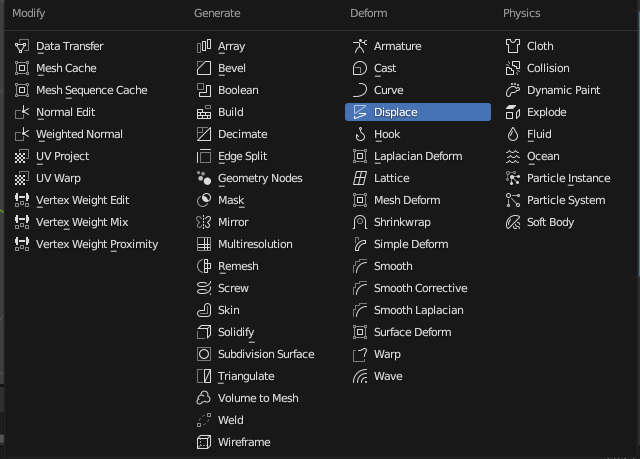

## MODİFİERS

Objeyi doğrudan değiştirmeden üzerine etkiler ekleyebilirsin. **Birden fazla modifiers eklersen sıralamaya göre çalışmaktadır. En üsten en altta gibi çalışabilir.**

Modifiersarı uygularsanız şekil öyle kalır birdaha değiştirmezsiniz modifersları.

Uygulama işlemi için herhangi bir modifers ekleyin.

 

Aşağıdaki menüden apply basarsanız uygulanır şekil böyle kalır.

 

Monitör ikonu modiferın etkisini kapatır. 
Kamera renderda kapatır. 
Sondaki edit modda modifierın görünüp görünmeyeceğini gösterir.
Bazen ücçgen şeklide gelir oda edit modda istediğin şekilde değişebileceğini gösterir.

🔧 MODIFY (Düzenleme Odaklı Modifier'lar) 

Genellikle nesnenin geometrisini doğrudan etkilemeyen modifierslardır.
Data Transfer: Bir objeden diğerine vertex, edge, normal gibi verileri aktarır.

Mesh Cache: Dışarıdan gelen bir animasyon datasını objeye uygular (örneğin .mdd, .pc2 formatları).

Mesh Sequence Cache: Birden fazla mesh dosyasını zamanla sırayla göstererek animasyon yaratır (Alembic formatı gibi).

Normal Edit: Normal (yüzey yönü) verilerini düzenlemeni sağlar, shading üzerinde etkilidir.

Weighted Normal: Normal yönlerini ağırlıklandırarak shading'i geliştirir (örneğin hard surface modellerde).

UV Project: Kameraya göre UV yansıması yapar (kamera projektörü gibi).

UV Warp: UV haritasını bir boş objeyle (empty) hareket ettirebilir veya döndürebilir.

Vertex Weight Edit: Vertex gruplarındaki ağırlıkları düzenlemene yarar.

Vertex Weight Mix: İki vertex grubunun ağırlıklarını karıştırır.

Vertex Weight Proximity: Diğer bir objeye olan uzaklığa göre vertex ağırlığı oluşturur.

🧱 GENERATE (Yeni Şekil ve Yapı Üreten Modifier'lar) Objenin genel görünümünü ve geometrisini değiştirir. Yapıcı ve yıkıcı etkileri bulunmaktadır. Bir nevi mevcut geometriden yeni geometri oluşturan veya çoğaltan modifiye edicileri içerir. 

Array Modifiers : Objeyi belirli eksenlerde çoğaltır.

 

🔴 Fit Type (Uydurma Tipi): Bu bölüm, dizinin kaç kopya içereceğini veya belirli bir uzunluğa nasıl sığdırılacağını belirler.

1. Fixed Count (Sabit Sayı): Diziye eklenecek kopya sayısını doğrudan belirtmenizi sağlar. Altındaki Count (Sayı) değeri şu anda 9 olarak ayarlanmış, yani orijinal nesne dahil olmak üzere toplam 9 kopya oluşturulacak.

2. Fit Length (Uzunluğa Sığdır): Dizinin toplam uzunluğunu belirtirsiniz ve Blender, belirtilen uzunluğa sığacak kadar kopya oluşturur.

3. Fit Curve (Eğriye Sığdır): Bir eğri nesnesi oluşturursanız (shift+a curve seçecneği ile) ve kopya sayısı eğrinin uzunluğuna göre ayarlanır.
Relative Offset (Göreli Öteleme): Bu seçenek işaretliyken, her bir kopya orijinal nesnenin boyutuna göre ötelenir.

Factor X, Y, Z: Bu değerler, her bir kopyanın X, Y ve Z eksenlerinde ne kadar ötelenmesi gerektiğini belirler. 

Şu anda:
Factor X: 1.000: Her kopya, orijinal nesnenin X eksenindeki boyutu kadar sağa (eğer nesnenin X boyutu pozitifse) ötelenir.
Y: 0.000: Y ekseninde herhangi bir öteleme olmaz.
Z: 0.000: Z ekseninde herhangi bir öteleme olmaz.

    ▶️ Örneğin, bir küpünüz varsa ve X faktörü 1 ise, her yeni küp bir önceki küpün tam yanına yerleşir. Eğer X faktörü 2 ise, aralarında bir küp boşluk olur.

🔴 Constant Offset (Sabit Öteleme): Bu bölüm genişletilebilir (yanındaki '>' işaretine tıklayarak). İşaretlendiğinde, her bir kopya belirli bir sabit mesafe kadar ötelenir. Bu, orijinal nesnenin boyutundan bağımsızdır.

🔴 Object Offset (Nesne Ötelemesi): Bu bölüm de genişletilebilir. İşaretlendiğinde, öteleme miktarı ve yönü seçilen başka bir nesnenin (genellikle bir boş nesne - Empty) konumuna ve rotasyonuna göre belirlenir. Bu, daha karmaşık ve dinamik diziler oluşturmak için kullanışlıdır.

🔴 Merge (Birleştirme): Bu bölüm de genişletilebilir. İşaretlendiğinde, birbirine çok yakın olan kopya vertexleri birleştirilebilir. Bu, aralıksız ve tek bir örgü gibi görünen diziler oluşturmak için kullanışlıdır.

🔴 UVs: Bu bölüm de genişletilebilir. Dizi oluşturulurken UV haritalarının nasıl işleneceğini kontrol eden seçenekleri içerir.

🔴 Caps (Kaplamalar): Bu bölüm de genişletilebilir. Açık uçlu dizilerin (örneğin bir eğri boyunca oluşturulan dizi) başlangıcına ve sonuna kapaklar eklemek için seçenekler sunar.

Bevel: Kenarları yumuşatır/kırar. Gerçekçi modellemeler için çok kullanılır.

Boolean: Objeyi başka bir objeyle keser, birleştirir veya çıkarır.

Build: Objenin görünmesini zamanla kontrol eder (animasyon gibi).

Decimate: Poligon sayısını azaltır. Düşük çözünürlük gerekliyse kullanılır.

Edge Split: Sert kenarları bölerek shading'i etkiler (autosmooth ile birlikte çalışır).

Geometry Nodes: Blender’ın node tabanlı sistemidir, çok güçlü procedural yapı sunar.

Mask: Objenin vertex gruplarına göre bir kısmını gizler.

Mirror: Simetrik modelleme için objeyi yansıtır.

Multiresolution: Sculpting için ideal. Farklı çözünürlük seviyelerinde çalışmanı sağlar.

Remesh: Objeyi yeniden topolojik olarak düzenler (özellikle heykel modellerde).

Screw: Objeyi dönerek uzatır; spiral ya da vidalı şekiller üretir.

Skin: Noktalardan iskelet benzeri bir yapı oluşturur (basit karakter modelleme için).

Solidify: İnce yüzeylere kalınlık verir.

Subdivision Surface: Mesh’i daha fazla subdivide eder, pürüzsüz hale getirir.

Triangulate: Tüm yüzeyleri üçgene dönüştürür.

Volume to Mesh: Volume (hacim) objelerini mesh'e çevirir.

Weld: Yakın vertexleri birleştirir.

Wireframe: Objenin sadece iskeletini/çerçevesini gösterir (ağ gibi).

🎛️ DEFORM (Objeyi Bükme, Şekil Bozma Modifier'ları)

Nesnenin şeklini bükme, germe, eğme gibi çeşitli yöntemlerle deforme eden modifiye edicileri içerir. Topoloji üzerinde doğrudan bir etkileri yoktur.

Armature: Kemik sistemiyle deformasyon sağlar (rigging için).

Cast: Objeyi küre, küp ya da silindire benzetecek şekilde şekillendirir.

Curve: Objenin bir eğri boyunca bükülmesini sağlar.

Displace: Texture verisiyle objeyi yukarı-aşağı iter (yükseklik map gibi).

Hook: Belirli vertexleri bir boş objeyle (empty) kontrol etmene yarar.

Laplacian Deform: Daha doğal ve yumuşak deformasyonlar sağlar (organik şekiller için).

Lattice: Kafes sistemi ile objeyi şekillendirir. Çok güçlü ve basit bir deform tekniğidir.

Mesh Deform: Dışarıdan bir kafesle (cage) objeyi sarar ve bu kafesi hareket ettirerek objeyi şekillendirir.

Shrinkwrap: Objenin yüzeyini başka bir objeye yapıştırır (örneğin bir yazıyı bir yüzeye sarma).

Simple Deform: Twist, Bend, Taper gibi temel deformasyonlar sağlar.

Smooth: Vertex'leri birbirine yaklaştırarak objeyi yumuşatır.

Smooth Corrective: Poz sonrası oluşan gariplikleri düzeltir (genellikle armature sonrası).

Smooth Laplacian: Daha sofistike bir smoothing algoritması kullanır.

Surface Deform: Başka bir objeye bağlanarak onun yüzey hareketlerini takip eder.

Warp: İki boş objeye göre objeyi bükmeye yarar.

Wave: Dalga efekti verir (animasyonlarda kullanılır).

🌊 PHYSICS (Fizik Tabanlı Modifier'lar)
Simülasyon ve efektler
Cloth: Kumaş simülasyonu uygular.

Collision: Diğer simülasyonların bu objeyle çarpışmasını sağlar.

Dynamic Paint: Obje yüzeyine animasyonlu şekilde boyama yapılmasını sağlar (fırça veya canvas olabilir).

Explode: Objeyi parçalayarak patlama efekti yaratır (particle sistemiyle çalışır).

Fluid: Akışkan simülasyonu için kullanılır (eski sistem, yeni sistem Geometry Nodes ile yapılır).

Ocean: Okyanus efekti oluşturur.

Particle Instance: Particle sistemindeki objelerin kopyalanmasını sağlar.

Particle System: Parçacık sistemi oluşturur (saç, patlama, yağmur vs.).

Soft Body: Esnek objelerin fiziksel simülasyonunu sağlar (jel gibi cisimler).

